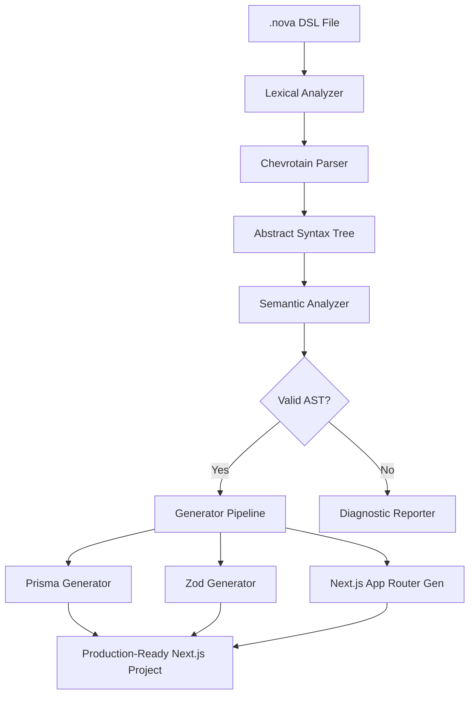

# Nova Technical Architecture Document (TAD/TDD)

---

## 1. System Overview
Nova is designed as a multi-stage application compiler that consumes a declarative configuration and outputs standard JavaScript/TypeScript projects. The compilation workflow operates as follows:



The parsing, semantic validation, AST compilation, and CLI orchestration are executed locally in TypeScript. Codebases are output directly to the local filesystem. 

---

## 2. Repository Structure & Workspace (File-Level)
The Nova project is structured as a `pnpm` monorepo coordinated by `Turborepo` to manage dependencies, execution cycles, and project compilation tasks.

### 2.1 Workspace Configuration: `pnpm-workspace.yaml`
```yaml
packages:
  - 'apps/*'
  - 'packages/*'
  - 'templates/*'
```

### 2.2 Turborepo Orchestration: `turbo.json`
```json
{
  "$schema": "https://turbo.build/schema.json",
  "pipeline": {
    "build": {
      "dependsOn": ["^build"],
      "outputs": ["dist/**", ".next/**", "out/**"]
    },
    "lint": {
      "dependsOn": ["^build"]
    },
    "test": {
      "dependsOn": ["build"],
      "outputs": []
    },
    "dev": {
      "cache": false,
      "persistent": true
    }
  }
}
```

### 2.3 Detailed Directory Layout (Down to File Level)
```
/ (Workspace Root)
  ├── package.json
  ├── pnpm-workspace.yaml
  ├── turbo.json
  ├── tsconfig.json
  ├── apps/
  │   ├── docs/
  │   │   ├── package.json
  │   │   ├── tsconfig.json
  │   │   └── next.config.js
  │   └── playground/
  │       ├── package.json
  │       ├── tsconfig.json
  │       └── src/
  │           ├── app/
  │           │   ├── layout.tsx
  │           │   └── page.tsx
  │           └── components/
  │               ├── Editor.tsx
  │               └── Preview.tsx
  └── packages/
      ├── parser/
      │   ├── package.json
      │   ├── tsconfig.json
      │   └── src/
      │       ├── index.ts
      │       ├── tokens.ts
      │       ├── parser.ts
      │       └── visitor.ts
      ├── compiler/
      │   ├── package.json
      │   ├── tsconfig.json
      │   └── src/
      │       ├── index.ts
      │       ├── ast.ts
      │       ├── analyzer.ts
      │       └── validator.ts
      ├── generator-prisma/
      │   ├── package.json
      │   ├── tsconfig.json
      │   └── src/
      │       ├── index.ts
      │       └── mapper.ts
      ├── generator-zod/
      │   ├── package.json
      │   ├── tsconfig.json
      │   └── src/
      │       ├── index.ts
      │       └── schema.ts
      ├── generator-nextjs/
      │   ├── package.json
      │   ├── tsconfig.json
      │   └── src/
      │       ├── index.ts
      │       ├── action.ts
      │       ├── page.ts
      │       ├── route.ts         # REST API routers emitter
      │       ├── layout.ts        # App UI layout and sidebar configurations
      │       └── component.ts     # shadcn forms and charting canvas emitter
      ├── openrouter/
      │   ├── package.json
      │   ├── tsconfig.json
      │   └── src/
      │       ├── index.ts
      │       └── client.ts
      ├── cli/
      │   ├── package.json
      │   ├── tsconfig.json
      │   └── src/
      │       ├── index.ts
      │       └── commands/
      │           ├── init.ts
      │           └── generate.ts
      └── lsp/
          ├── package.json
          ├── tsconfig.json
          └── src/
              ├── index.ts
              └── server.ts
```

---

## 3. Package Dependency Matrix
Dependencies inside the monorepo are managed through workspace protocols:

| Package | Workspace Dependencies | External Dependencies |
| --- | --- | --- |
| `packages/parser` | None | `chevrotain` |
| `packages/compiler` | `packages/parser` | `typescript`, `ts-morph` |
| `packages/generator-prisma`| `packages/parser`, `packages/compiler` | None |
| `packages/generator-zod` | `packages/parser`, `packages/compiler` | `zod` |
| `packages/generator-nextjs` | `packages/parser`, `packages/compiler` | `ejs`, `prettier` |
| `packages/cli` | `packages/parser`, `packages/compiler` | `commander`, `chalk` |
| `packages/openrouter` | None | `openai`, `zod-to-json-schema` |
| `packages/lsp` | `packages/parser` | `vscode-languageserver` |

---

## 4. Compiler Design
The compilation core runs inside the `compiler` package, exporting a main `compile(dslText: string, options: CompilerOptions): Promise<CompilationResult>` entrypoint.

---

## 5. Parser Design
The parser relies on **Chevrotain**, a high-performance parser generator library for JavaScript.

---

## 6. AST Schema (TypeScript Definitions)
The AST structure is defined as a TypeScript compiler schema. Refer to the complete interface blocks inside the implementation blueprint.

---

## 7. Semantic Analysis Rules
The Semantic Analysis phase processes the parsed AST to enforce compile-time correctness:

1. **Unique Entity Rule**: All entity, dashboard, and workflow names must be unique within the global namespace.
2. **Unique Field Rule**: Field names inside a single entity must be unique.
3. **Relation Check**: If a field references another entity (e.g., `user User`), the target entity (`User`) must exist in the AST declarations.
4. **Identifier Resolution**: Verifies that workflow steps or dashboard blocks reference valid entities and existing entity fields.

---

## 8. Code Generators
Generators translate the validated AST into specific file outputs.

### 8.1 Prisma Generator (`packages/generator-prisma`)
Translates AST `EntityNode` declarations to Prisma format.

### 8.2 Zod Generator (`packages/generator-zod`)
Emits input schema validation files. For each entity, it writes a `[EntityName]Schema.ts` exporting validators:
* `CreateSchema`: Validates fields required on creation.
* `UpdateSchema`: All fields marked optional, checking types on incoming patches.

### 8.3 Next.js App Router Generator (`packages/generator-nextjs`)
Outputs App Router directory structures.

---

## 9. Template Engine
The template engine uses **EJS** (Embedded JavaScript templates) to inject AST variables into pre-designed React components.

---

## 10. CLI Design
The CLI is built with `commander.js`.

---

## 11. LSP Design
The LSP package runs as a separate Node.js process using the VS Code Language Server protocol.

---

## 12. OpenRouter Integration
The `packages/openrouter` package manages communication with the LLM.

---

## 13. Agent System
Nova implements four specialised agents:
1. **Architecture Agent**: Evaluates the database schemas and designs user layout matrices.
2. **Code Generation Agent**: Writes custom React page blocks using clean Tailwind configurations.
3. **Testing Agent**: Assembles Playwright test configurations mapping to the UI layout.
4. **Repair Agent**: Evaluates linting and TypeScript failures, generating corrective patches.

---

## 14. Database Model (PostgreSQL Relational DDL)
The following DDL definitions represent the relational schemas generated by Nova's default multi-tenant target:

```sql
-- Database structures mapping multi-tenancy rules
CREATE TABLE "User" (
    "id" UUID PRIMARY KEY DEFAULT gen_random_uuid(),
    "email" TEXT UNIQUE NOT NULL,
    "passwordHash" TEXT NOT NULL,
    "name" TEXT,
    "createdAt" TIMESTAMP WITH TIME ZONE DEFAULT CURRENT_TIMESTAMP,
    "updatedAt" TIMESTAMP WITH TIME ZONE DEFAULT CURRENT_TIMESTAMP
);

CREATE TABLE "Organization" (
    "id" UUID PRIMARY KEY DEFAULT gen_random_uuid(),
    "name" TEXT NOT NULL,
    "slug" TEXT UNIQUE NOT NULL,
    "createdAt" TIMESTAMP WITH TIME ZONE DEFAULT CURRENT_TIMESTAMP
);

CREATE TABLE "Membership" (
    "id" UUID PRIMARY KEY DEFAULT gen_random_uuid(),
    "role" TEXT NOT NULL DEFAULT 'MEMBER' CHECK ("role" IN ('ADMIN', 'MEMBER', 'VIEWER')),

    "userId" UUID NOT NULL REFERENCES "User"("id") ON DELETE CASCADE,
    "orgId" UUID NOT NULL REFERENCES "Organization"("id") ON DELETE CASCADE,
    UNIQUE("userId", "orgId")
);

CREATE TABLE "Session" (
    "id" UUID PRIMARY KEY DEFAULT gen_random_uuid(),
    "sessionToken" TEXT UNIQUE NOT NULL,
    "userId" UUID NOT NULL REFERENCES "User"("id") ON DELETE CASCADE,
    "expires" TIMESTAMP NOT NULL
);

-- Indexing rules to optimize relational join query speed
CREATE INDEX "idx_membership_user" ON "Membership"("userId");
CREATE INDEX "idx_membership_org" ON "Membership"("orgId");
CREATE INDEX "idx_session_user" ON "Session"("userId");
```

---

## 15. Authentication Architecture
Uses **Auth.js** (Next-Auth) mapping credentials to database tables:
* Middleware intercepts requests to `/app` or `/api`, enforcing authorization.
* JWT tokens contain user permissions, roles, and organization scope configurations to prevent data leakage.

---

## 16. Testing Implementation
* **Vitest**: Runs inside `packages/*` executing parser and compiler verification test cases.
* **Playwright**: Installed in the generated project, executing browser sessions to verify login forms and CRUD pages.

---

## 17. Deployment Pipeline (CI/CD GitHub Actions)
The complete verification workflow runs in GitHub Actions:

```yaml
name: CI/CD Pipeline

on:
  push:
    branches: [ main ]
  pull_request:
    branches: [ main ]

jobs:
  build_and_test:
    runs-on: ubuntu-latest
    steps:
      - name: Checkout source code
        uses: actions/checkout@v4

      - name: Install Node.js
        uses: actions/setup-node@v4
        with:
          node-version: 20

      - name: Setup pnpm
        uses: pnpm/action-setup@v3
        with:
          version: 9

      - name: Restore pnpm cache
        uses: actions/cache@v4
        with:
          path: ~/.local/share/pnpm/store
          key: ${{ runner.os }}-pnpm-store-${{ hashFiles('**/pnpm-lock.yaml') }}
          restore-keys: |
            ${{ runner.os }}-pnpm-store-

      - name: Install dependencies
        run: pnpm install --frozen-lockfile

      - name: Check code formatting
        run: pnpm run lint

      - name: Build compiler monorepo
        run: pnpm run build

      - name: Run Unit Tests (Vitest)
        run: pnpm run test

      - name: Run E2E Integration Suite (Playwright)
        run: |
          pnpm exec playwright install --with-deps
          pnpm run test:e2e
```

---

## 18. Observability & Telemetry
* **Logging**: Uses structured JSON logging (Winston) containing scope, trace IDs, and levels.
* **Metrics**: Compiles execution speeds, parser errors, and LLM call durations to report diagnostic stats.

---

## 19. Security Model
* **Zod Sanitation**: Verifies payload fields match schema layouts, rejecting untrusted inputs.
* **CSRF Protection**: Next.js Server Actions automatically validate tokens, blocking Cross-Site Request Forgeries.
* **RBAC Verification**: Database roles are validated on every database query using Prisma interceptors.

---

## 20. Performance Optimization
* **Turborepo Caching**: Tasks match outputs to build caching states.
* **Incremental Builds**: The parser processes modified files, compiling only changed segments.

---

## 21. Plugin System
Developers can add external templates:
* Plugins implement a `NovaPlugin` interface, receiving AST inputs and returning file mappings.
* Allows extensions like generating NestJS backends, OpenAPI specs, or Flutter client interfaces.

---

## 22. Implementation Plan
* **Phase 1 (Core)**: Chevrotain parser parser setup, basic TypeScript AST node trees.
* **Phase 2 (Generators)**: Prisma schema output and initial CRUD server actions.
* **Phase 3 (Frontend)**: Next.js page generation, Tailwind setups, shadcn theme injection.
* **Phase 4 (Launch)**: OpenRouter agent verification, test automation suites, Docker pipeline configuration.
